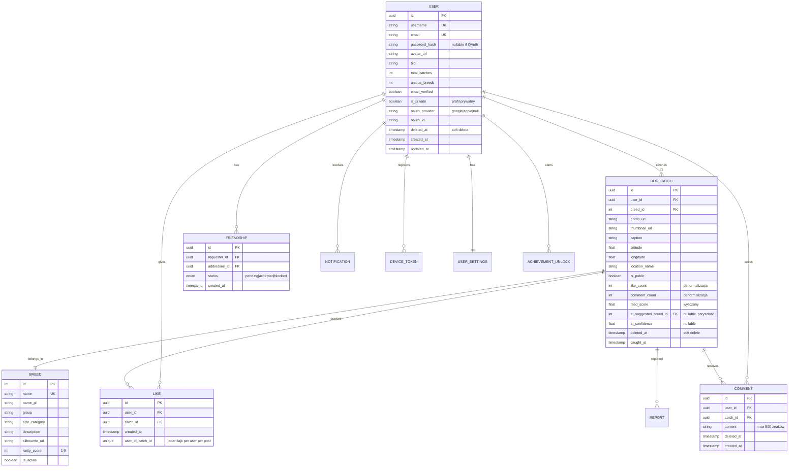
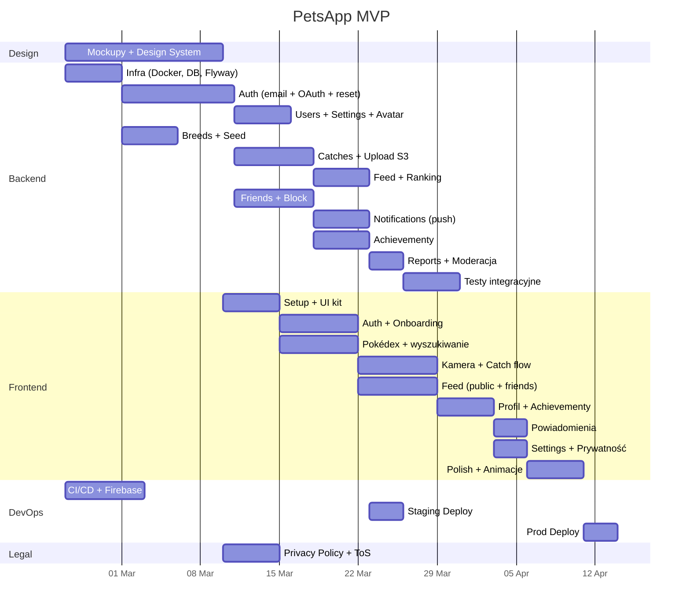

# PetsApp — Kompletny Plan Budowy

Aplikacja mobilna do kolekcjonowania zdjęć psów według ras. User fotografuje psy, buduje Pokédex ras, dzieli się zdobyczami ze znajomymi w feedzie.

---

## 1. Stos Technologiczny

### Frontend (Mobile)

| Warstwa | Technologia |
|---|---|
| **Framework** | React Native + Expo |
| **Język** | TypeScript |
| **Nawigacja** | React Navigation v7 |
| **State** | Zustand |
| **Zapytania API** | TanStack Query (React Query) |
| **Kamera** | `expo-camera` + `expo-image-picker` |
| **Stylowanie** | NativeWind (Tailwind for RN) |
| **Push** | `expo-notifications` + Firebase Cloud Messaging |
| **OAuth** | `expo-auth-session` + `@react-native-google-signin` |

### Backend

| Warstwa | Technologia |
|---|---|
| **Język** | Java 21 LTS |
| **Framework** | Spring Boot 3.3 |
| **Build** | Maven |
| **Walidacja** | Jakarta Bean Validation + Hibernate Validator |
| **Upload plików** | Spring Multipart + Thumbnailator |
| **Auth** | Spring Security + JWT (access + refresh) |
| **OAuth** | Spring Security OAuth2 Client (Google, Apple) |
| **API Docs** | SpringDoc OpenAPI (Swagger UI) |
| **Email** | Spring Mail + Resend (lub AWS SES) |
| **Push** | Firebase Admin SDK (FCM + APNs) |
| **Scheduler** | Spring `@Scheduled` (feed rebuild, cleanup) |
| **Realtime** | Spring WebSocket + STOMP |

### Baza Danych i Infra

| Warstwa | Technologia |
|---|---|
| **DB** | PostgreSQL 16 |
| **ORM** | Spring Data JPA + Hibernate |
| **Migracje** | Flyway |
| **Cache** | Redis |
| **Storage zdjęć** | AWS S3 (lub Cloudflare R2) |
| **CDN** | CloudFront (lub Cloudflare) |
| **Hosting** | Docker + AWS ECS (lub Railway na start) |
| **CI/CD** | GitHub Actions |
| **Monitoring** | Sentry (errors) + Grafana/Prometheus |
| **Logi** | SLF4J + Logback (JSON) |
| **Secrets** | AWS Secrets Manager (prod), `.env` (dev) |

---

## 2. Schemat Bazy Danych (PostgreSQL)

### Główne tabele



### Tabele auth i systemowe

```sql
-- Refresh tokeny (możliwość unieważnienia)
CREATE TABLE refresh_token (
    id          UUID PRIMARY KEY DEFAULT gen_random_uuid(),
    user_id     UUID NOT NULL REFERENCES "user"(id) ON DELETE CASCADE,
    token_hash  VARCHAR(255) NOT NULL UNIQUE,
    device_info VARCHAR(255),
    expires_at  TIMESTAMP NOT NULL,
    created_at  TIMESTAMP NOT NULL DEFAULT now()
);

-- Weryfikacja emaila
CREATE TABLE email_verification (
    id          UUID PRIMARY KEY DEFAULT gen_random_uuid(),
    user_id     UUID NOT NULL REFERENCES "user"(id) ON DELETE CASCADE,
    code        VARCHAR(6) NOT NULL,  -- 6-cyfrowy kod
    expires_at  TIMESTAMP NOT NULL,   -- ważny 24h
    used_at     TIMESTAMP,
    created_at  TIMESTAMP NOT NULL DEFAULT now()
);

-- Reset hasła
CREATE TABLE password_reset (
    id          UUID PRIMARY KEY DEFAULT gen_random_uuid(),
    user_id     UUID NOT NULL REFERENCES "user"(id) ON DELETE CASCADE,
    token_hash  VARCHAR(255) NOT NULL UNIQUE,
    expires_at  TIMESTAMP NOT NULL,   -- ważny 1h
    used_at     TIMESTAMP,
    created_at  TIMESTAMP NOT NULL DEFAULT now()
);

-- Push notification tokeny
CREATE TABLE device_token (
    id          UUID PRIMARY KEY DEFAULT gen_random_uuid(),
    user_id     UUID NOT NULL REFERENCES "user"(id) ON DELETE CASCADE,
    token       VARCHAR(512) NOT NULL UNIQUE,
    platform    VARCHAR(10) NOT NULL, -- 'ios' | 'android'
    created_at  TIMESTAMP NOT NULL DEFAULT now()
);

-- Powiadomienia in-app
CREATE TABLE notification (
    id          UUID PRIMARY KEY DEFAULT gen_random_uuid(),
    user_id     UUID NOT NULL REFERENCES "user"(id) ON DELETE CASCADE,
    type        VARCHAR(50) NOT NULL, -- 'like' | 'comment' | 'friend_request' | 'friend_accepted' | 'achievement'
    title       VARCHAR(255) NOT NULL,
    body        VARCHAR(500),
    data_json   JSONB,                -- {catch_id, user_id, etc.}
    is_read     BOOLEAN DEFAULT false,
    created_at  TIMESTAMP NOT NULL DEFAULT now()
);

-- Ustawienia usera
CREATE TABLE user_settings (
    user_id             UUID PRIMARY KEY REFERENCES "user"(id) ON DELETE CASCADE,
    push_likes          BOOLEAN DEFAULT true,
    push_comments       BOOLEAN DEFAULT true,
    push_friend_requests BOOLEAN DEFAULT true,
    push_achievements   BOOLEAN DEFAULT true,
    language            VARCHAR(5) DEFAULT 'pl',
    dark_mode           BOOLEAN DEFAULT false
);

-- Zgłoszenia (moderacja)
CREATE TABLE report (
    id          UUID PRIMARY KEY DEFAULT gen_random_uuid(),
    reporter_id UUID NOT NULL REFERENCES "user"(id),
    catch_id    UUID REFERENCES dog_catch(id),
    user_id     UUID REFERENCES "user"(id),
    reason      VARCHAR(50) NOT NULL, -- 'spam' | 'inappropriate' | 'abuse' | 'other'
    description VARCHAR(500),
    status      VARCHAR(20) DEFAULT 'pending', -- 'pending' | 'reviewed' | 'resolved'
    created_at  TIMESTAMP NOT NULL DEFAULT now()
);

-- Achievementy (definicje)
CREATE TABLE achievement (
    id          INT PRIMARY KEY GENERATED ALWAYS AS IDENTITY,
    code        VARCHAR(50) UNIQUE NOT NULL, -- 'first_catch', 'ten_breeds', 'rare_hunter'
    name        VARCHAR(100) NOT NULL,
    name_pl     VARCHAR(100) NOT NULL,
    description VARCHAR(255),
    icon_url    VARCHAR(500),
    condition_type VARCHAR(50) NOT NULL,     -- 'total_catches' | 'unique_breeds' | 'breed_rarity' | 'streak'
    condition_value INT NOT NULL             -- np. 10 dla "złap 10 psów"
);

-- Odblokowane achievementy
CREATE TABLE achievement_unlock (
    id             UUID PRIMARY KEY DEFAULT gen_random_uuid(),
    user_id        UUID NOT NULL REFERENCES "user"(id) ON DELETE CASCADE,
    achievement_id INT NOT NULL REFERENCES achievement(id),
    unlocked_at    TIMESTAMP NOT NULL DEFAULT now(),
    UNIQUE(user_id, achievement_id)
);
```

### Kluczowe indeksy

```sql
CREATE INDEX idx_catch_user        ON dog_catch (user_id, caught_at DESC);
CREATE INDEX idx_catch_breed       ON dog_catch (breed_id);
CREATE INDEX idx_catch_feed        ON dog_catch (is_public, caught_at DESC) WHERE deleted_at IS NULL;
CREATE INDEX idx_catch_score       ON dog_catch (feed_score DESC) WHERE deleted_at IS NULL AND is_public = true;
CREATE INDEX idx_friendship        ON friendship (requester_id, addressee_id, status);
CREATE INDEX idx_friendship_reverse ON friendship (addressee_id, requester_id, status);
CREATE INDEX idx_like_catch        ON "like" (catch_id);
CREATE UNIQUE INDEX idx_like_unique ON "like" (user_id, catch_id);
CREATE INDEX idx_notification_user ON notification (user_id, is_read, created_at DESC);
CREATE INDEX idx_refresh_token     ON refresh_token (token_hash);
CREATE INDEX idx_device_token_user ON device_token (user_id);
CREATE INDEX idx_report_status     ON report (status, created_at DESC);
```

### Seed data: `BREED`
~200 ras psów (AKC/FCI). Każda rasa ma:
- `rarity_score` (1-5) — rzadsza rasa = więcej punktów
- `silhouette_url` — sylwetka nieodkrytej rasy (jak nieotkryty Pokémon)

### Seed data: `ACHIEVEMENT`
```
first_catch       | Pierwszy Łów         | total_catches >= 1
ten_catches       | Kolekcjoner          | total_catches >= 10
fifty_catches     | Łowca                | total_catches >= 50
five_breeds       | Odkrywca             | unique_breeds >= 5
twenty_breeds     | Ekspert Ras          | unique_breeds >= 20
fifty_breeds      | Profesor Oak         | unique_breeds >= 50
rare_hunter       | Łowca Rarytasów      | złapał psa z rarity >= 4
complete_group    | Mistrz Grupy         | wszystkie rasy z jednej grupy FCI
seven_day_streak  | Tygodniowy Streak    | 7 dni z rzędu z catch'em
```

---

## 3. Architektura API (REST)

### Standard response

Każdy endpoint zwraca ten sam format:

```json
// Sukces
{
  "success": true,
  "data": { ... },
  "pagination": { "cursor": "abc123", "hasMore": true }  // tylko na listach
}

// Błąd
{
  "success": false,
  "error": {
    "code": "VALIDATION_ERROR",
    "message": "Username is already taken",
    "fields": { "username": "already exists" }  // opcjonalne
  }
}
```

### Error codes

| Kod | HTTP | Kiedy |
|---|---|---|
| `VALIDATION_ERROR` | 400 | Błędne dane wejściowe |
| `UNAUTHORIZED` | 401 | Brak/nieprawidłowy token |
| `FORBIDDEN` | 403 | Brak uprawnień |
| `NOT_FOUND` | 404 | Zasób nie istnieje |
| `CONFLICT` | 409 | Duplikat (username, email, lajk) |
| `RATE_LIMITED` | 429 | Za dużo requestów |
| `FILE_TOO_LARGE` | 413 | Zdjęcie > 10MB |
| `UNSUPPORTED_FORMAT` | 415 | Nieprawidłowy format pliku |
| `INTERNAL_ERROR` | 500 | Błąd serwera |

### Wszystkie endpointy `/api/v1/...`

#### Auth
| Metoda | Endpoint | Opis |
|---|---|---|
| POST | `/auth/register` | Rejestracja (email + hasło) → wysyła kod weryfikacyjny |
| POST | `/auth/verify-email` | Weryfikacja emaila 6-cyfrowym kodem |
| POST | `/auth/resend-verification` | Ponowne wysłanie kodu |
| POST | `/auth/login` | Login → access token (15 min) + refresh token (7 dni) |
| POST | `/auth/refresh` | Nowy access token z refresh tokena |
| POST | `/auth/logout` | Unieważnienie refresh tokena |
| POST | `/auth/forgot-password` | Wysyła link do resetu hasła na email |
| POST | `/auth/reset-password` | Reset hasła z tokenem z emaila |
| POST | `/auth/google` | Logowanie/rejestracja przez Google (ID token) |
| POST | `/auth/apple` | Logowanie/rejestracja przez Apple (authorization code) |

#### Flow: Rejestracja email
```
1. POST /auth/register { email, username, password }
2. Backend → walidacja → zapis usera (email_verified=false) → wysyłka 6-cyfrowego kodu na email
3. POST /auth/verify-email { email, code }
4. Backend → aktywacja konta → zwrot access + refresh token
```

#### Flow: OAuth (Google)
```
1. Frontend: expo-auth-session → Google → ID token
2. POST /auth/google { idToken }
3. Backend: weryfikacja tokena z Google → znajdź/utwórz usera → zwrot access + refresh token
4. Jeśli nowy user → redirect na ekran wyboru username'a
```

#### Flow: Reset hasła
```
1. POST /auth/forgot-password { email }
2. Backend → generuje token → wysyła email z linkiem/kodem (ważny 1h)
3. POST /auth/reset-password { token, newPassword }
4. Backend → weryfikacja tokena → update hasła → unieważnienie wszystkich refresh tokenów
```

#### Użytkownicy
| Metoda | Endpoint | Opis |
|---|---|---|
| GET | `/users/me` | Mój profil (statystyki, avatar, bio) |
| PATCH | `/users/me` | Edycja profilu (username, bio) |
| POST | `/users/me/avatar` | Upload/zmiana zdjęcia profilowego |
| DELETE | `/users/me/avatar` | Usunięcie avatara |
| PATCH | `/users/me/password` | Zmiana hasła (wymagane stare hasło) |
| PATCH | `/users/me/email` | Zmiana emaila (wysyła nowy kod weryfikacyjny) |
| DELETE | `/users/me` | Usunięcie konta (soft delete, anonimizacja po 30 dniach) |
| GET | `/users/me/export` | Eksport danych usera jako ZIP (GDPR) |
| GET | `/users/:id` | Profil innego usera (respektuje prywatność, zwraca: avatar, bio, statystyki, czy jest znajomym) |
| GET | `/users/:id/catches?cursor=` | Zdjęcia innego usera (grid na jego profilu, paginated) |
| GET | `/users/search?q=` | Wyszukiwanie po username |

#### Flow: Usunięcie konta (GDPR/App Store)
```
1. DELETE /users/me { password }  (potwierdzenie hasłem)
2. Backend → soft delete (deleted_at = now())
3. Natychmiast: user wylogowany, token unieważniony, profil niewidoczny
4. Po 30 dniach: cron job → anonimizacja danych (username → "deleted_xxx", email → null, zdjęcia → usunięte z S3)
5. User może się zalogować w ciągu 30 dni żeby przywrócić konto
```

#### Ustawienia
| Metoda | Endpoint | Opis |
|---|---|---|
| GET | `/users/me/settings` | Pobierz ustawienia |
| PATCH | `/users/me/settings` | Zmień ustawienia (push, język, dark mode, prywatność) |

#### Pokédex (Rasy)
| Metoda | Endpoint | Opis |
|---|---|---|
| GET | `/breeds` | Lista ras (filtr: `?q=`, `?group=`, `?size=`) |
| GET | `/breeds/:id` | Szczegóły rasy + globalne statystyki |
| GET | `/users/:id/pokedex` | Pokédex usera (które rasy odkrył) |
| GET | `/users/:id/pokedex/stats` | Statystyki: postęp, ulubiona rasa, streak |

#### Łapanie psów
| Metoda | Endpoint | Opis |
|---|---|---|
| POST | `/catches` | Nowe złapanie (`multipart/form-data`) |
| GET | `/catches/:id` | Szczegóły |
| DELETE | `/catches/:id` | Usunięcie (soft delete) |
| POST | `/catches/:id/like` | Polub |
| DELETE | `/catches/:id/like` | Cofnij polubienie |
| GET | `/catches/:id/comments` | Lista komentarzy (paginated) |
| POST | `/catches/:id/comments` | Dodaj komentarz |
| DELETE | `/comments/:id` | Usuń swój komentarz |
| POST | `/catches/:id/report` | Zgłoś nieodpowiednie zdjęcie |

#### Feed
| Metoda | Endpoint | Opis |
|---|---|---|
| GET | `/feed/public?cursor=&limit=20` | Feed publiczny (ranked) |
| GET | `/feed/friends?cursor=&limit=20` | Feed znajomych (chronologiczny lub ranked) |
| GET | `/feed/trending?limit=10` | Top 10 postów z ostatnich 24h |

#### Znajomi
| Metoda | Endpoint | Opis |
|---|---|---|
| GET | `/friends` | Lista znajomych (avatar, username, unique_breeds) |
| POST | `/friends/request/:userId` | Wyślij zaproszenie |
| POST | `/friends/accept/:requestId` | Akceptuj |
| POST | `/friends/reject/:requestId` | Odrzuć |
| DELETE | `/friends/:friendshipId` | Usuń znajomego |
| GET | `/friends/requests` | Oczekujące zaproszenia (wysłane + otrzymane) |
| GET | `/friends/leaderboard` | Ranking znajomych (by unique_breeds DESC) |
| POST | `/users/:id/block` | Zablokuj usera |
| DELETE | `/users/:id/block` | Odblokuj |

#### Powiadomienia
| Metoda | Endpoint | Opis |
|---|---|---|
| GET | `/notifications?cursor=` | Lista powiadomień |
| POST | `/notifications/read-all` | Oznacz wszystkie jako przeczytane |
| POST | `/notifications/:id/read` | Oznacz jedno jako przeczytane |
| GET | `/notifications/unread-count` | Liczba nieprzeczytanych (badge) |

#### Achievementy
| Metoda | Endpoint | Opis |
|---|---|---|
| GET | `/achievements` | Wszystkie achievementy (z info czy odblokowane) |
| GET | `/users/:id/achievements` | Achievementy usera |

#### Device tokens (push)
| Metoda | Endpoint | Opis |
|---|---|---|
| POST | `/devices` | Rejestracja tokena FCM/APNs |
| DELETE | `/devices/:token` | Wyrejestrowanie (logout, zmiana urządzenia) |

#### System
| Metoda | Endpoint | Opis |
|---|---|---|
| GET | `/health` | Health check (DB + Redis + S3) |
| GET | `/health/ready` | Readiness check (dla load balancera) |

### Upload zdjęć — flow

```
1. POST /catches (multipart/form-data: photo + breed_id + caption + is_public)
2. Backend:
   a. Walidacja MIME type (jpeg/png/webp), max 10MB
   b. Thumbnailator: resize → 800px (main) + 200px (thumbnail)
   c. Konwersja do WebP (mniejszy rozmiar)
   d. Upload na S3: /catches/{user_id}/{uuid}.webp + /catches/{user_id}/{uuid}_thumb.webp
   e. Zapis URL w DB
   f. Sprawdzenie achievementów (async)
   g. Powiadomienie znajomych (async, push)
3. Response: catch object z URL-ami
```

---

## 4. Push Notyfikacje

### Kiedy wysyłać

| Zdarzenie | Tytuł | Body |
|---|---|---|
| Nowy lajk | "❤️ {username}" | "polubił Twoje zdjęcie {breed}" |
| Nowy komentarz | "💬 {username}" | "{treść komentarza}" |
| Zaproszenie do znajomych | "👋 {username}" | "chce zostać Twoim znajomym" |
| Zaproszenie zaakceptowane | "✅ {username}" | "zaakceptował Twoje zaproszenie" |
| Nowy achievement | "🏆 {achievement_name}" | "Odblokowano nowe osiągnięcie!" |

### Implementacja

- Firebase Admin SDK (Java) → obsługuje FCM (Android) i APNs (iOS) jednocześnie
- Wysyłka async (`@Async` + `CompletableFuture`) żeby nie blokować odpowiedzi API
- Respektuj `user_settings` (user może wyłączyć poszczególne powiadomienia)
- Batch: jeśli user dostaje 10 lajków w minutę → grupuj w jedno powiadomienie

---

## 5. Bezpieczeństwo

| Warstwa | Mechanizm |
|---|---|
| **Hasło** | BCryptPasswordEncoder (cost 12), min 8 znaków, wymagana wielka litera + cyfra |
| **Autentykacja** | Spring Security + JWT: access (15 min) + refresh (7 dni, HttpOnly cookie) |
| **OAuth** | Google: weryfikacja ID tokena przez googleapis. Apple: weryfikacja authorization code |
| **HTTPS** | TLS 1.3, wymuszone wszędzie |
| **Rate Limiting** | Bucket4j + Redis — 100 req/min ogólne, 5/min login, 3/min register, 10/min upload |
| **Walidacja** | Jakarta Bean Validation (`@Valid`) na każdym DTO |
| **Upload** | Whitelist MIME (jpeg/png/webp), max 10MB, strip EXIF metadata (prywatność) |
| **SQL Injection** | Spring Data JPA (parameterized queries) |
| **XSS** | OWASP Java HTML Sanitizer na komentarzach/captionach |
| **CORS** | `WebMvcConfigurer` — tylko domeny aplikacji |
| **Security Headers** | Spring Security (CSP, X-Frame-Options, HSTS) |
| **Soft Delete** | Usunięte dane mają `deleted_at`, fizyczne usunięcie po 30 dniach |
| **GDPR** | Endpoint eksportu danych usera, usunięcie konta z anonimizacją |
| **Abuse** | Report system + rate limit uploadu |

---

## 6. Algorytm Feed (Ranking postów)

MVP serwuje chronologicznie, ale ranking powinien być gotowy kiedy app zacznie żyć.

### Formuła

```
score = (likes * 1.0) + (comments * 2.0) + (rarity_bonus)
         ─────────────────────────────────────────────────
                    (hours_since_post + 2) ^ 1.5
```

| Składnik | Opis |
|---|---|
| `likes * 1.0` | Każdy lajk = 1 punkt |
| `comments * 2.0` | Komentarz = 2× (wyższe zaangażowanie) |
| `rarity_bonus` | `breed.rarity_score * 3` — rzadsze rasy dostają boost |
| `(hours + 2) ^ 1.5` | Time decay — starsze posty spadają |

### Cache w Redis

- Sorted sets: `feed:public`, `feed:friends:{userId}`
- Aktualizacja: przy każdym lajku/komentarzu → `ZADD`
- Pełny rebuild: cron co 15 min dla postów z ostatnich 7 dni
- Cursor pagination: `ZREVRANGEBYSCORE` z limitem
- TTL: feed znajomych = 5 min, publiczny = 15 min

### Cold start
Nowy user bez znajomych → widzi feed publiczny. Po dodaniu znajomych feed się buduje.

### Trending
Top 10 z ostatnich 24h — osobny sorted set `feed:trending`, rebuild co 5 min.

---

## 7. Gamifikacja

### Achievementy — sprawdzanie

Po każdym `POST /catches`:
1. Backend (async) sprawdza warunki achievementów
2. Jeśli odblokowany → zapis do `achievement_unlock` + push notification
3. Frontend pokazuje animowany popup z nowym achieveementem

### Statystyki usera

Endpoint `GET /users/:id/pokedex/stats` zwraca:

```json
{
  "totalCatches": 47,
  "uniqueBreeds": 23,
  "completionPercent": 11.5,
  "currentStreak": 5,
  "longestStreak": 12,
  "favoriteBreed": { "id": 42, "name": "Golden Retriever", "catchCount": 8 },
  "rarestCatch": { "id": 15, "name": "Azawakh", "rarityScore": 5 },
  "achievementsUnlocked": 7,
  "achievementsTotal": 15
}
```

### Ranking znajomych

`GET /friends/leaderboard` — sorted by `unique_breeds` DESC. Cache w Redis, rebuild co godzinę.

---

## 8. Struktura Projektu

```
petsapp/
├── mobile/                            # React Native (Expo)
│   ├── app/                           # Expo Router
│   │   ├── (tabs)/
│   │   │   ├── feed.tsx
│   │   │   ├── friends.tsx
│   │   │   ├── catch.tsx
│   │   │   ├── pokedex.tsx
│   │   │   └── profile.tsx
│   │   ├── auth/
│   │   │   ├── login.tsx
│   │   │   ├── register.tsx
│   │   │   ├── verify-email.tsx
│   │   │   ├── forgot-password.tsx
│   │   │   └── onboarding.tsx
│   │   ├── catch/[id].tsx
│   │   ├── user/[id].tsx
│   │   ├── settings.tsx
│   │   ├── notifications.tsx
│   │   ├── achievements.tsx
│   │   └── _layout.tsx
│   ├── components/
│   │   ├── ui/
│   │   ├── feed/
│   │   ├── pokedex/
│   │   └── catch/
│   ├── hooks/
│   ├── services/                      # API client
│   ├── stores/                        # Zustand
│   ├── types/
│   └── utils/
│
├── backend/                           # Java Spring Boot
│   ├── pom.xml
│   ├── src/main/java/com/petsapp/
│   │   ├── PetsAppApplication.java
│   │   ├── config/                    # SecurityConfig, S3Config, RedisConfig, CorsConfig, FirebaseConfig
│   │   ├── auth/                      # AuthController, AuthService, JwtProvider, JwtFilter, OAuthService
│   │   ├── user/                      # UserController, UserService, User, UserDTO, UserRepository, UserSettingsService
│   │   ├── breed/                     # BreedController, BreedService, Breed, BreedRepository
│   │   ├── catch_/                    # CatchController, CatchService, DogCatch, CatchRepository
│   │   ├── feed/                      # FeedController, FeedService, FeedRankingService
│   │   ├── friend/                    # FriendController, FriendService, Friendship, BlockService
│   │   ├── notification/              # NotificationController, NotificationService, PushService
│   │   ├── achievement/               # AchievementService, AchievementChecker
│   │   ├── report/                    # ReportController, ReportService
│   │   ├── storage/                   # S3StorageService, ImageResizer
│   │   ├── email/                     # EmailService (weryfikacja, reset)
│   │   ├── scheduler/                 # FeedRebuildJob, AccountCleanupJob, StatsUpdateJob
│   │   └── common/                    # GlobalExceptionHandler, ApiResponse, PagedResponse, ErrorCode
│   ├── src/main/resources/
│   │   ├── application.yml
│   │   ├── application-dev.yml
│   │   ├── application-prod.yml
│   │   └── db/migration/
│   │       ├── V1__init_schema.sql
│   │       ├── V2__seed_breeds.sql
│   │       └── V3__seed_achievements.sql
│   └── src/test/java/com/petsapp/
│
├── docker-compose.yml                 # PostgreSQL + Redis + MailHog (dev)
├── docs/
│   ├── privacy-policy.md
│   ├── terms-of-service.md
│   └── api-changelog.md
└── README.md
```

---

## 9. Nawigacja Mobilna (UX)

```mermaid
graph TD
    A[Bottom Tab Bar] --> B["Feed"]
    A --> C["Znajomi"]
    A --> D["Złap!"]
    A --> E["Pokédex"]
    A --> F["Profil"]

    B --> B1[Infinite scroll ranked]
    B --> B2[Tap post → szczegóły + lajki + komentarze]
    B --> B3[Tap avatar → profil usera]
    B --> B4[Trending sekcja na górze]

    C --> C1[Feed znajomych]
    C --> C2[Zaproszenia badge]

    D --> D1[Kamera → zdjęcie → wybór rasy → opis → publikuj]

    E --> E1[Siatka ras - odkryte vs sylwetki]
    E --> E2[Wyszukiwarka + filtry]
    E --> E3[Pasek postępu]

    F --> F1[Avatar + bio + statystyki]
    F --> F2[Moje zdjęcia grid]
    F --> F3[Achievementy odblokowane]
    F --> F4[Znajomi + leaderboard]
    F --> F5[Ustawienia ikona]
    F --> F6[Powiadomienia bell icon + badge]
```



### Ekran: Profil własny (`profile.tsx`)

```
┌─────────────────────────────────┐
│  [bell 🔔3]           [⚙️]     │  ← powiadomienia + ustawienia
│                                 │
│         [Avatar]                │
│       @username                 │
│     "Kocham psy!"               │  ← bio
│                                 │
│  47 złapane  │ 23 rasy │ 7 🏆  │  ← statystyki
│──────────────┼─────────┼────────│
│                                 │
│  [Moje zdjęcia]  [Achievementy] │  ← tab switcher
│                                 │
│  ┌─────┐ ┌─────┐ ┌─────┐       │
│  │ 🐕  │ │ 🐩  │ │ 🐶  │       │  ← grid 3 kolumny
│  └─────┘ └─────┘ └─────┘       │
│  ┌─────┐ ┌─────┐ ┌─────┐       │
│  │ 🐕  │ │ 🐩  │ │ 🐶  │       │
│  └─────┘ └─────┘ └─────┘       │
└─────────────────────────────────┘
```

### Ekran: Profil znajomego (`user/[id].tsx`)

```
┌─────────────────────────────────┐
│  ← Wstecz                      │
│                                 │
│         [Avatar]                │
│       @friend_name              │
│     "Opis znajomego"            │
│                                 │
│  32 złapane  │ 15 rasy │ 4 🏆  │
│──────────────┼─────────┼────────│
│                                 │
│  [Dodaj znajomego] / [Znajomy ✓] / [Oczekuje...] │
│                                 │
│  [Zdjęcia]  [Achievementy]      │
│                                 │
│  ┌─────┐ ┌─────┐ ┌─────┐       │  ← grid ze zdjęciami znajomego
│  │ 🐕  │ │ 🐩  │ │ 🐶  │       │    (GET /users/:id/catches)
│  └─────┘ └─────┘ └─────┘       │
└─────────────────────────────────┘

Jeśli profil prywatny i nie jesteś znajomym → "Profil prywatny"
```

### Ekran: Ustawienia (`settings.tsx`)

```
┌─────────────────────────────────┐
│  Ustawienia                     │
│                                 │
│  Konto                          │
│  ├── Zmień email                │
│  ├── Zmień hasło                │
│  └── Połączone konta (Google)   │
│                                 │
│  Prywatność                     │
│  ├── Profil prywatny  [toggle]  │
│  └── Eksport danych (GDPR)      │
│                                 │
│  Powiadomienia                  │
│  ├── Lajki           [toggle]   │
│  ├── Komentarze      [toggle]   │
│  ├── Zaproszenia     [toggle]   │
│  └── Achievementy    [toggle]   │
│                                 │
│  Wygląd                         │
│  ├── Ciemny motyw    [toggle]   │
│  └── Język                      │
│                                 │
│  [Wyloguj]                      │
│  [Usuń konto]  ← czerwony      │
└─────────────────────────────────┘
```

### Onboarding (nowy user)

```
1. Splash screen z logo
2. 3 slajdy: "Fotografuj psy" → "Buduj Pokédex" → "Rywalizuj ze znajomymi"
3. Rejestracja / Login / Google / Apple
4. Zgoda na regulamin + politykę prywatności (checkbox)
5. Weryfikacja emaila (jeśli email)
6. Wybór avatara + username
7. Gotowe → redirect na feed
```

---

## 10. Podział Pracy (Zespół)

| Rola | Zakres | Start |
|---|---|---|
| **Frontend 1** | Nawigacja, Auth (login/register/OAuth/verify), Onboarding, Profil | Od razu |
| **Frontend 2** | Feed (public/friends/trending), Infinite scroll, Lajki/Komentarze, Powiadomienia | Po UI kit |
| **Frontend 3** | Pokédex, Kamera/Catch flow, Achievementy, Leaderboard | Po UI kit |
| **Backend 1** | Spring Security, Auth (email + OAuth + reset), JWT, Users, Settings | Od razu |
| **Backend 2** | Catches, Feed + Ranking, S3 upload, ImageResizer | Po auth |
| **Backend 3** | Breeds, Friends + Block, Notifications (push), Achievementy, Reports | Po auth |
| **DevOps** | Docker, CI/CD, S3, CloudFront, Firebase, deploy pipeline | Od razu |
| **Designer** | Figma mockupy, Design system, ikony, onboarding ilustracje | Od razu |

### Harmonogram (MVP — ~10 tygodni)



---

## 11. Przyszłość — Detekcja Rasy (AI)

Osobny microservice (Python + FastAPI + PyTorch). Na MVP nie potrzebny, ale od razu:
- Kolumny `ai_suggested_breed_id` + `ai_confidence` już w schemacie
- Zbieranie par (zdjęcie, rasa) jako dataset treningowy
- Endpoint: `POST /api/v1/ai/detect-breed` → `[{breed: "Labrador", confidence: 0.92}]`

---

## 12. Wymagania App Store / Google Play

| Wymóg | Jak spełnić |
|---|---|
| **Polityka prywatności** | `docs/privacy-policy.md` + link w app i na landing page |
| **Regulamin** | `docs/terms-of-service.md` + link w rejestracji |
| **Usunięcie konta** | `DELETE /users/me` — wymagane od 2023 |
| **Apple Sign-In** | Obowiązkowe jeśli oferujesz social login |
| **Moderacja treści** | Report system + przegląd zgłoszeń |
| **GDPR** | Eksport danych, zgoda na przetwarzanie, anonimizacja po usunięciu |
| **Wiek** | Checkbox "mam 13+ lat" przy rejestracji (COPPA) |
| **Permissions** | Wyjaśnienie dlaczego potrzebujesz kamery/lokalizacji (usage description) |

---

## 13. Zasady dla Zespołu

1. **Git Flow** — `main` → `develop` → `feature/xxx` → PR → merge
2. **Frontend** — ESLint + Prettier, conventional commits
3. **Backend** — Checkstyle + Google Java Style, Spotless
4. **API Contract** — Swagger UI jako źródło prawdy, API versioning (`/api/v1/`)
5. **Code Review** — min. 1 approval
6. **Środowiska** — `dev` (Docker), `staging` (z `develop`), `prod` (z `main`)
7. **Testy** — JUnit 5 + Mockito (unit), Testcontainers (integration)
8. **Changelog** — `docs/api-changelog.md` przy każdej zmianie API
